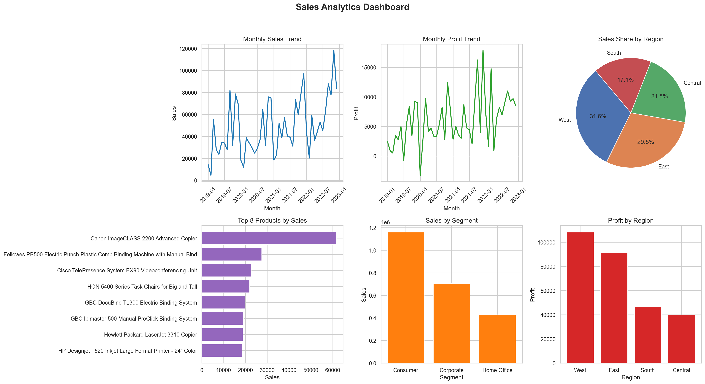
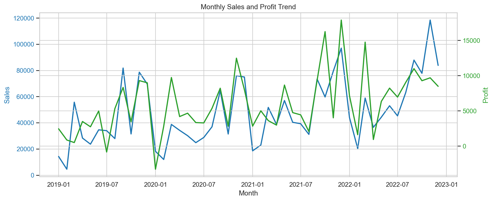
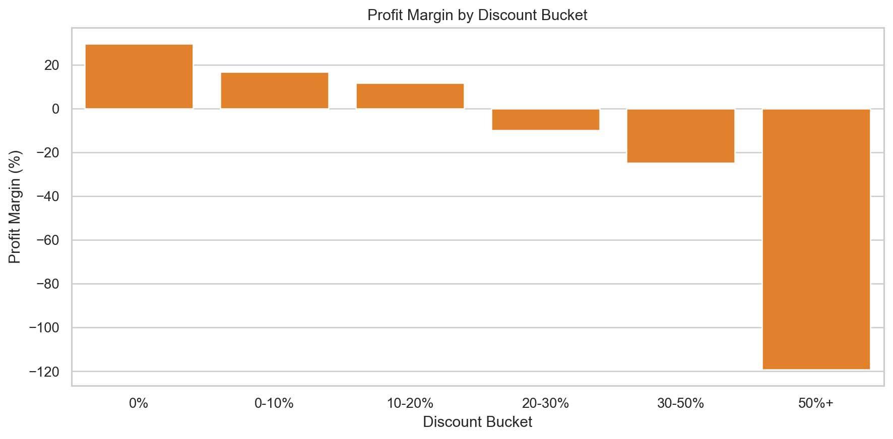
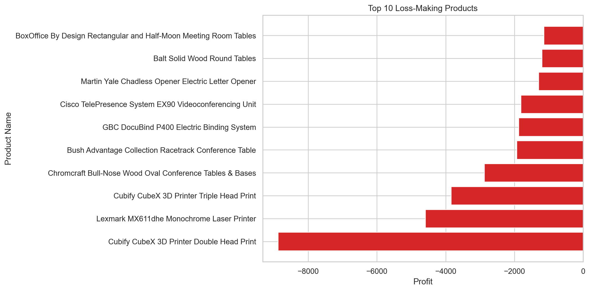

# Sales Data Analysis Dashboard

## Problem Statement
Analyze retail sales data to identify:
- Profit leakage areas
- High-value customers
- Impact of discount strategies

## Goal
Improve profitability and customer retention.

## Project Overview
This project uses Superstore sales data to move from raw transactions to business decisions:
- Detect where profit is being lost
- Identify which products/customers need attention
- Recommend pricing and retention actions

## Tech Stack
- Python
- Pandas
- Matplotlib
- Seaborn

## Dataset
- Dataset: **Superstore Sales Dataset**
- File used: `data.csv`
- Source:  
  https://raw.githubusercontent.com/nileshely/SuperStore-Dataset-2019-2022/main/superstore_dataset.csv

## Project Structure
```text
sales-analysis/
├── data.csv
├── analysis.ipynb
├── dashboard.png
├── screenshots/
│   ├── monthly_sales_profit_trend.png
│   ├── discount_profit_impact.png
│   └── loss_making_products.png
└── README.md
```

## Visualizations
### Overall Dashboard


### Monthly Sales and Profit Trend


### Discount Impact on Profitability


### Loss-Making Products


## Results
- Total Sales: **$2,297,200.86**
- Total Profit: **$286,397.02**
- Profit margin for discounts `>30%`: **-48.16%**
- Profit margin for discounts `<=30%`: **20.19%**
- Top 10 loss-making products contribute **38.22%** of total product-level losses
- Repeat customers (5+ orders) contribute **87.87%** of revenue

## Key Insights
- High discounts (`>30%`) reduce profit significantly
- Few products generate majority of losses
- Loyal customers contribute major revenue

## Business Impact
- Can increase profit by optimizing discount strategy
- Helps target high-value customers effectively

## Recommended Decisions
1. Cap or review deep-discount transactions where margin consistently turns negative.
2. Fix recurring loss-making products through repricing, bundling, or supplier renegotiation.
3. Prioritize retention campaigns for repeat high-value customers.

## How to Run
1. Open `analysis.ipynb` in Jupyter Notebook or VS Code.
2. Run all cells to reproduce cleaning, analysis, and charts.
3. Use `dashboard.png` and `screenshots/` images in your GitHub showcase.
